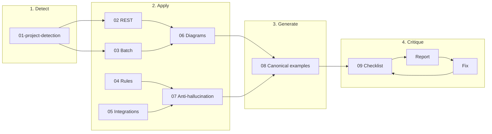

# How to Use This Guide

**Purpose**: Define how an LLM (and humans) use this documentation instruction set to generate and maintain project documentation for Spring Boot and Spring Batch applications.

**Related**: [INDEX.md](INDEX.md)

---

## At a glance

- **LLM**: Analyse codebase → detect project type → generate docs from canonical examples → run critique until clean or human approves.
- **Human**: Use INDEX and this guide for flow; use canonical examples (08) for quality bar; use critique (09) to review.

---

## Preconditions (LLM)

Before generating documentation, ensure you have:

| Requirement | Details |
|-------------|---------|
| **Access** | Full project (source, build files, configuration under repo root). |
| **Build files** | `build.gradle` / `build.gradle.kts` or `pom.xml` to detect stack and dependencies. |
| **Source tree** | Java/Kotlin sources (e.g. `src/main/java`), resources (e.g. `src/main/resources`), and `application*.properties` / `application*.yml`. |
| **No assumption** | If something is not in the repo (e.g. external API spec), do not invent it; document only what is present and note gaps in the critique report. |

---

## Audience

- **LLM**: Primary consumer. Follow guides in order; use canonical examples; run the critique flow before considering documentation complete.
- **Humans**: Developers, business analysts, auditors, management. Use for onboarding, handover, review, and compliance. Docs must be readable and traceable without requiring code expertise for high-level understanding.

---

## Role of the LLM

1. **Analyse** the codebase (source, config, Gradle/Maven) to detect project type and scope.
2. **Generate** documentation that matches the structure and style of the canonical examples (08).
3. **Trace** logic from controller/service to database/mapper and describe behaviour in **business terms**.
4. **Use only Mermaid** for diagrams; follow diagram style rules (06).
5. **Never** invent endpoints, assume authentication, or guess status codes (07).
6. **Critique** the generated documentation using the checklist (09) and fix inconsistencies.

---

## Order of operations



1. Read [01-project-detection.md](01-project-detection.md) and determine: **Spring Boot (REST)**, **Spring Batch**, or **both**.
2. Read the relevant content guides (02–05) and [06-diagrams-mermaid.md](06-diagrams-mermaid.md), [07-anti-hallucination.md](07-anti-hallucination.md).
3. Use [08-canonical-examples.md](08-canonical-examples.md) as the exact template for each doc type you produce.
4. Generate docs under **`/docs`** using the output structure below.
5. Run the [09-critique-and-consistency.md](09-critique-and-consistency.md) flow: apply the checklist, produce an inconsistency report, fix issues, then re-check until the report is clean or the human approves exceptions.

---

## Failure and ambiguity handling

| Situation | Action |
|-----------|--------|
| **Detection unclear** (e.g. both web and batch present) | Document both; state in the project overview that “Both Spring Boot (REST) and Spring Batch were detected” and apply guides 02 and 03. |
| **Code path unclear** (e.g. reflection, dynamic dispatch) | Document what you can infer from static analysis; in the doc, add “Call path may include dynamic behaviour; see code at [file:line].” |
| **Missing code** (e.g. generated or external) | Do not invent. Document only the entry/exit points present in the repo and note “Implementation not in repo.” |
| **OpenAPI/code mismatch** | Code is source of truth. Document the implemented behaviour and in the critique report list “OpenAPI says X, code does Y” so the human can fix the spec or the code. |

---

## Output structure (best practice)

Write all generated documentation under **`/docs`**. Organise as follows:

```
docs/
├── INDEX.md                    # Entry point (if mirroring this set)
├── api/                        # Generated REST API docs (if Spring Boot)
│   ├── overview.md             # API overview + overview diagram
│   ├── endpoints/
│   │   ├── by-controller or by-domain (as per 02)
│   │   └── <name>.md           # One file per endpoint or logical group
│   └── openapi/                # Optional: exported or referenced OpenAPI
├── batch/                      # Generated Batch docs (if Spring Batch)
│   ├── overview.md             # All jobs list + overview
│   ├── jobs/
│   │   └── <job-name>.md       # One file per job
│   └── steps/                  # Optional: shared step details
├── business-rules/
│   └── rules.md                # Or split by domain if large
├── integrations/
│   ├── overview.md             # Integration architecture diagram
│   ├── rest.md
│   ├── soap.md
│   └── messaging.md
├── deployment.md               # Deployment, env, DB schema (per 10)
└── canonical-examples/         # Optional: copy of 08 examples for reference
```

- Use **industry best practice** for grouping (e.g. by domain or controller; for a financial institution, domain-oriented grouping is often preferred).
- One **overview** per area (API, batch, integrations) with a Mermaid overview diagram.
- Per-endpoint and per-job docs include **sequence** and **flow** diagrams as specified in 02 and 03.

---

## When documentation is “done”

Documentation is **done** for a given pass when all of the following hold:

1. **Coverage**: Every endpoint, job, and outbound integration present in code is documented; no documented item is absent from code.
2. **Traceability**: Every factual claim (path, method, status code, rule, integration detail) has a **code reference** (file and symbol or config key).
3. **Form**: All docs follow the structure in [08-canonical-examples.md](08-canonical-examples.md); all diagrams are Mermaid and comply with [06-diagrams-mermaid.md](06-diagrams-mermaid.md).
4. **Critique**: The [09-critique-and-consistency.md](09-critique-and-consistency.md) checklist has been run, the inconsistency report has no **blocker** issues, and any remaining exceptions are explicitly accepted by a human.
