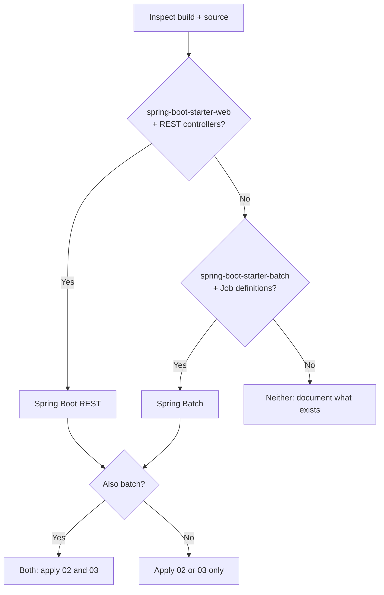

# Project Detection: Spring Boot vs Spring Batch

**Purpose**: Determine whether the project is Spring Boot (REST API), Spring Batch, or both, so the correct documentation guides are applied.

**Related**: [00-how-to-use-this-guide.md](00-how-to-use-this-guide.md), [02-rest-api-documentation.md](02-rest-api-documentation.md), [03-batch-documentation.md](03-batch-documentation.md)

---

## Sources to inspect

Use **code and configuration** as the source of truth. Do not assume; infer from:

| Source | What to look for |
|--------|-------------------|
| **Build files** | **Gradle**: `build.gradle`, `build.gradle.kts` — `spring-boot`, `spring-boot-starter-web`, `spring-boot-starter-batch`, `spring-batch-core`. **Maven**: `pom.xml` — same dependencies. |
| **Source structure** | **REST**: packages with `@RestController`, `@Controller`, `@RequestMapping` (or WebFlux equivalents). **Batch**: classes with `@Configuration` defining `Job`, `JobBuilderFactory`, `StepBuilderFactory`; `ItemReader`, `ItemWriter`, `ItemProcessor`; `JobLauncher`. |
| **Configuration** | `application.properties` / `application.yml`: batch job names, datasources, web context path, server port. Profiles (e.g. `application-batch.yml`) that indicate batch-only runs. |

---

## Detection logic

| If you find | Then treat as |
|-------------|---------------|
| `spring-boot-starter-web` (or WebFlux) and REST controllers | **Spring Boot (REST)** — apply REST API documentation (02). |
| `spring-boot-starter-batch` (or `spring-batch-*`) and at least one `Job` definition | **Spring Batch** — apply Batch documentation (03). |
| Both of the above | **Both** — apply 02 and 03; document REST and Batch in separate sections under `/docs/api` and `/docs/batch`. |
| Neither | Do not document as Spring Boot REST or Spring Batch; document what is actually present (e.g. library, CLI). |

---

## Detection summary (output)

In the generated docs, include a **Detection summary** (e.g. in `docs/overview.md` or the top of `docs/README.md`) with:

| Field | Content |
|-------|---------|
| **Project type** | Spring Boot (REST), Spring Batch, or both. |
| **Build tool** | Gradle or Maven (and version if easily visible). |
| **Key dependencies** | e.g. `spring-boot-starter-web`, `spring-boot-starter-batch`, and any OpenAPI/Swagger dependencies. |
| **Detection source** | Short note, e.g. “Detected from `build.gradle` and `*Controller` classes in `src/main/java`.” |

This gives humans and the LLM a single place to confirm what was detected and what documentation to expect.

---

## Uncertainty

| Case | Action |
|------|--------|
| Both web and batch dependencies exist but only one is used in source (e.g. batch only in tests) | Document the type that is used in production code and note in the detection summary: “Batch present in dependencies; no production Job definitions found” (or the reverse). |
| No controllers and no Job definitions | Do not document as REST or Batch; state “No Spring Boot REST or Spring Batch detected” and document only what is present (e.g. library, CLI). |
