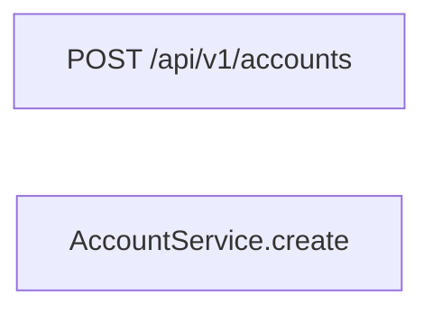
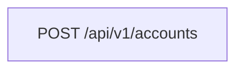

# Diagrams: Mermaid Only

**Purpose**: All charts and diagrams must be in **Mermaid** only. No ASCII art, no external image files for architecture or flow. This ensures version control, diffs, and consistent rendering in GitHub, GitLab, and common Markdown viewers.

**Related**: [02-rest-api-documentation.md](02-rest-api-documentation.md), [03-batch-documentation.md](03-batch-documentation.md), [05-integrations.md](05-integrations.md)

---

## Mermaid only

Use **only** Mermaid for:

- Flowcharts (process, job flow, data flow)
- Sequence diagrams (API call flow, batch step flow)
- State diagrams (state transitions)
- Architecture / component diagrams (graph with subgraphs)

Do **not** use ASCII art, generated PNG/SVG checked into the repo, or other diagram formats for these purposes.

---

## Diagram style rules

### 1. Labels with special characters

Mermaid can throw **“Lexical error: Unrecognized text”** if labels contain certain characters. **Wrap node/label text in double quotes** when it contains:

- Forward slash `/` (e.g. paths like `/api/v1/accounts`)
- Equals `=`, colons `:`, parentheses `()`, brackets `[]`
- Other symbols that may be parsed as Mermaid syntax

**Quick reference**: If in doubt, quote the label.

### 2. Correct (quoted)

### 3. Incorrect (unquoted path can break parsing)

### 4. Validate

Before considering documentation complete, ensure diagrams render. Use [Mermaid Live Editor](https://mermaid.live/) or a local Mermaid-capable viewer to verify.

### 5. Accessibility

Use clear, consistent participant or node names (e.g. "AccountService" not "Svc" unless abbreviated in a key). Do not rely on colour or shape alone to convey meaning; use labels.

---

## When to use which diagram type

| Need | Diagram type | Example use |
|------|----------------|-------------|
| API or step call order | Sequence | Controller → Service → Repository → DB |
| Job step order and decisions | Flowchart | Step1 → Step2 → Decision → Step3 |
| State transitions (business rules) | State diagram | DRAFT → SUBMITTED → PAID |
| System and external components | Graph (subgraphs) | App, DB, REST client, Queue |
| Data flow (batch step) | Flowchart | Table → Reader → Processor → Writer |

Reference: [Mermaid documentation](https://mermaid.js.org/).
