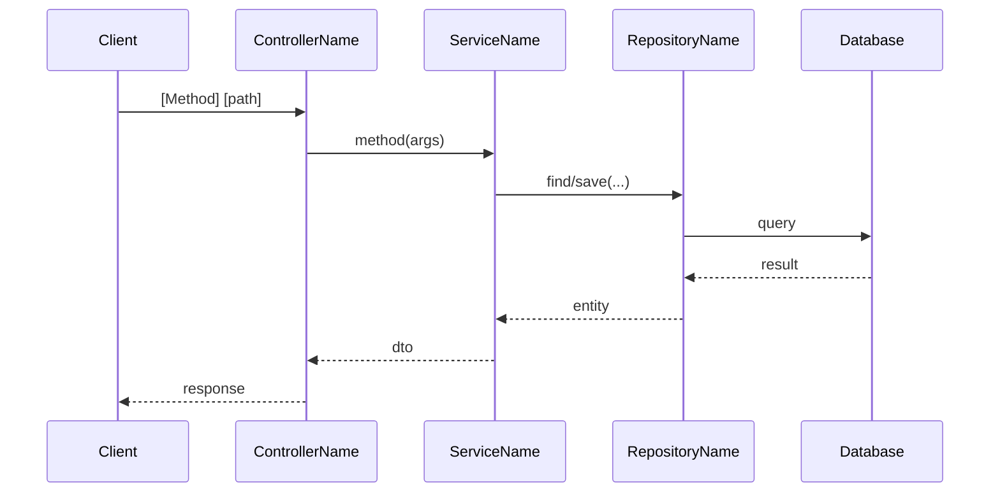
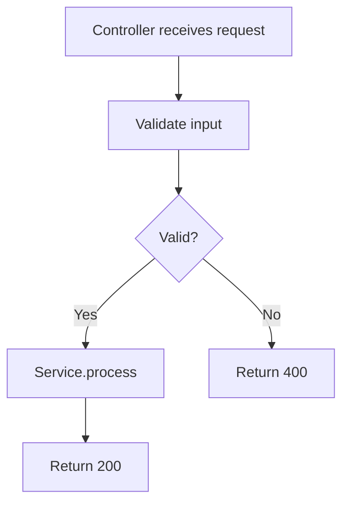
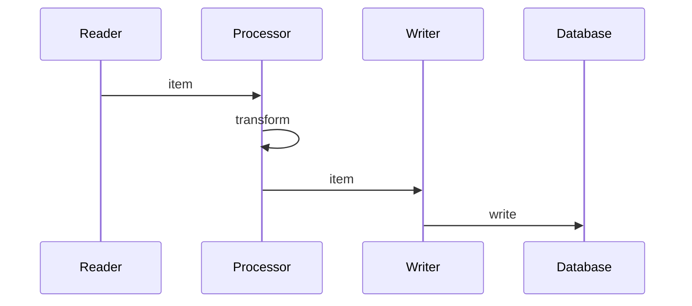
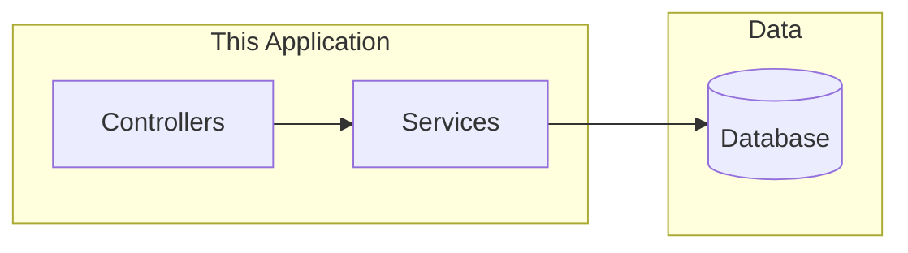

# Canonical Examples

**Purpose**: Strict examples for each document type. The LLM must match this **structure and style** when generating documentation. Use these as templates; fill with real content from the codebase. Do not invent content that is not in code.

**Related**: [02-rest-api-documentation.md](02-rest-api-documentation.md), [03-batch-documentation.md](03-batch-documentation.md), [04-business-rules.md](04-business-rules.md), [05-integrations.md](05-integrations.md)

---

## Example 1: REST endpoint (single endpoint)

**Use for**: Each REST endpoint doc. Replace placeholders with values **derived from code only**. Do not add status codes, auth, or parameters not present in code.

**Structure:**

```markdown
# [HTTP Method] [Path]

**Controller**: `fully.qualified.ControllerName.methodName`
**Summary (business)**: [One sentence: what this endpoint does for the business.]

## Contract

| Item | Value |
|------|--------|
| Path | `[e.g. /api/v1/accounts]` |
| Method | `[GET|POST|PUT|PATCH|DELETE]` |
| Request body | [Type and key fields, or "None"] |
| Response body | [Type and key fields] |
| Status codes (from code) | [e.g. 200, 404 — only those present in code] |
| Query/path/header params | [Name, type, required? — from method params] |

## Call path (code)

Controller → Service → Repository/Mapper → Database (and back).
[1–3 sentences describing the flow as in code, then business summary.]

## Sequence diagram

[Insert Mermaid sequence diagram — see pattern below.]

## Flow diagram

[Insert Mermaid flowchart — see pattern below.]
```

**Sequence diagram pattern:**



**Flow diagram pattern:**



---

## Example 2: Batch job

**Use for**: Each batch job doc. All content must come from code/config.

```markdown
# Job: [job-name]

**Definition**: `fully.qualified.ConfigClass`
**Summary**: [One sentence: what this job does for the business.]

## Configuration (from code)

| Item | Value |
|------|--------|
| Job name | `[exact name from JobBuilder]` |
| Chunk size | [number or "default"] |
| Reader | [Type and source, e.g. JdbcCursorItemReader — table X] |
| Writer | [Type and target] |
| Processor | [Type and brief behaviour or "None"] |
| Retry/skip | [As in code or "default"] |
| Scheduling | [Cron / on-demand / trigger from config] |

## Steps (order)

1. [step-name-1]
2. [step-name-2]
3. [decision or step-name-3] — [brief]

## Job flow diagram

[Insert Mermaid flowchart: Step1 → Step2 → Decision → Step3a/Step3b]

## Step: [step-name-1]

[Optional: per-step sequence or data-flow diagram when non-trivial.]
```

**Per-step sequence pattern:**



---

## Example 3: Business rule (table format)

**Use for**: Multiple rules; each row must have a **code reference**.

```markdown
# Business rules: [domain or topic]

| ID | Description | Type | Source (code reference) |
|----|-------------|------|--------------------------|
| BR-001 | [e.g. Order moves to SUBMITTED only when balance check passes] | State transition | `OrderService.submit()` — line X / `Order.java` |
| BR-002 | [e.g. Interest = principal × rate × months; rounded to 2 decimals] | Calculation | `InterestCalculator.apply()` — `InterestCalculator.java` |
```

For a single rule or short list:

```markdown
- **BR-001**: [Description]. **Source**: `ClassName.methodName()` in `File.java`.
```

For state transitions, add a Mermaid state diagram with transitions; annotate with “Source: …” in the doc.

---

## Example 4: Integration (REST outbound)

**Use for**: Each REST client / outbound API.

```markdown
# Integration: [Client or API name]

**Purpose**: [One sentence from code.]
**Client class**: `fully.qualified.RestClientOrConfig`

| Item | Value |
|------|--------|
| Base URL | [From config/code] |
| Auth | [Type and where configured — e.g. Header X from property Y] |
| Operations | [List: Method + path or description] |
| Retries | [As in code or "None"] |
| Timeouts | [As in code or "Default"] |

## Sequence (example operation)

[Insert Mermaid sequence: This Application → External API]
```

---

## Example 5: Integration (SOAP)

**Use for**: Each SOAP client.

```markdown
# Integration: [SOAP service name]

**WSDL**: [URL or path from config/code]
**Client or config class**: `fully.qualified.ClientClass`

| Item | Value |
|------|--------|
| Operations | [List: operation name and purpose from code] |
| Request/response types | [Main types as used in code] |
| Security | [As in code/config or "None"] |

## Sequence (example operation)

[Insert Mermaid sequence: This Application → SOAP Service]
```

---

## Example 6: Integration (message queue)

**Use for**: Each queue or topic (consumer/producer).

```markdown
# Integration: [Queue or topic name]

**Purpose**: [Consume / Produce from code.]
**Listener or producer class**: `fully.qualified.Class`

| Item | Value |
|------|--------|
| Queue / topic | [Name from config/code] |
| Message format | [DTO class or schema reference from code] |
| Consumer group / subscription | [From config or "N/A"] |
| Delivery semantics | [At-least-once / exactly-once when in code or "Not specified in code"] |

## Flow

[Insert Mermaid flowchart: Queue ↔ Listener/Producer]
```

---

## Example 7: API overview (with diagram)

**Use for**: `docs/api/overview.md`.

```markdown
# API overview

**Context path**: [from config or "/"]
**Base URL (example)**: `http://localhost:8080/api/v1`

## Endpoints by [domain | controller]

| Method | Path | Summary |
|--------|------|---------|
| GET | /api/v1/accounts | List accounts |
| POST | /api/v1/accounts | Create account |
| GET | /api/v1/accounts/{id} | Get account by ID |

## Architecture (overview)

[Insert Mermaid graph: Controllers → Services → Database]
```

**Overview diagram pattern:**



---

When generating docs, **reuse these structures exactly**; only the content (paths, class names, descriptions derived from code) changes. If a section does not apply (e.g. no processor in a step), write “None” or “N/A” and cite code.
